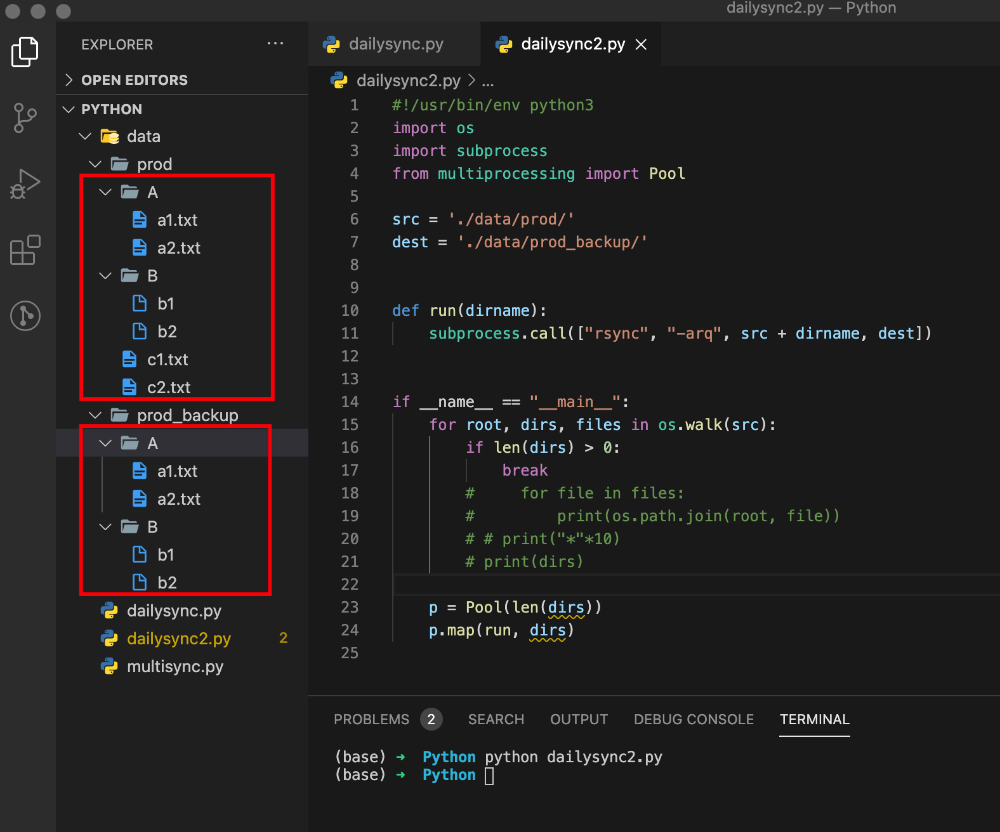
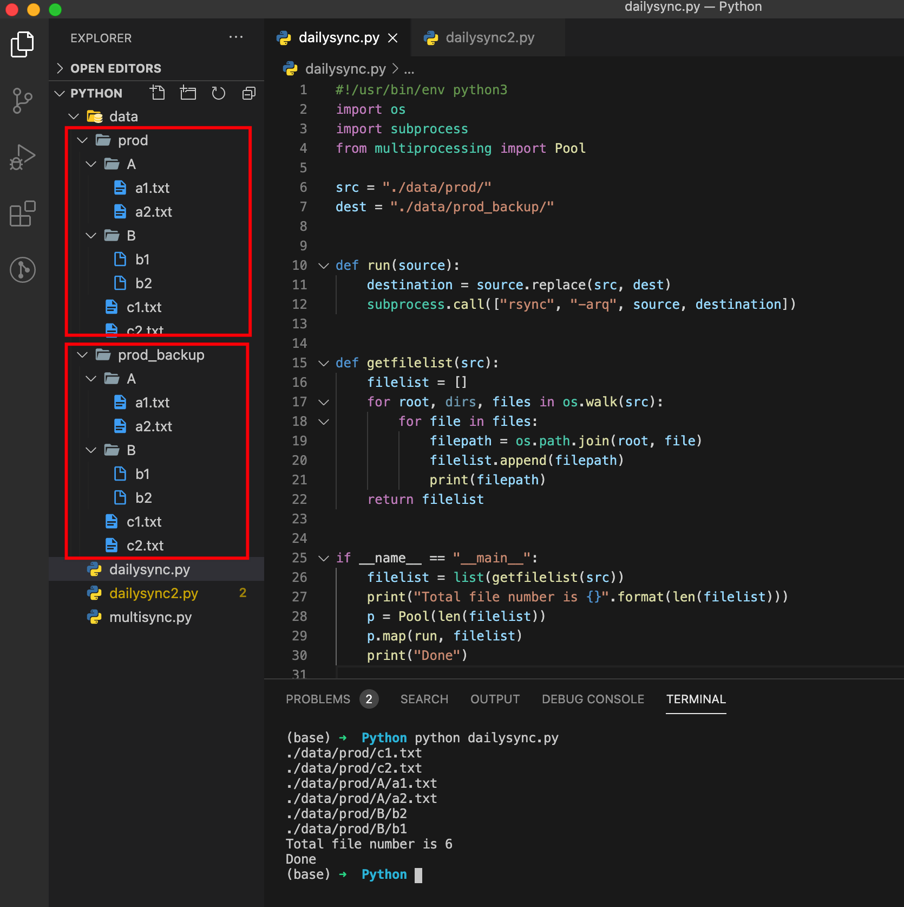

# Google Coursera: Troubleshooting and Debugging Techniques

Issue Time: Fri Nov 20 20:31:26 AEDT 2020

## Qwiklabs Assessment in Week 2:

## Results Comparison and Issues with "rsync"

I got passed on the Qwikilabs Assessment of week2 with the following code [dailysync2.py](dailysync2.py) and my local simulation. but this one only copies files by folders.

Run "run_test.sh" the scripts to see the results.

```bash
(base) ➜  Google_Coursera_Troubleshooting_Debugging_Techniques_Issues git:(master) ✗ bash run_test.sh
#1 directory based backup
data/
├── prod
│   ├── A
│   │   ├── a1.txt
│   │   └── a2.txt
│   ├── B
│   │   ├── b1
│   │   └── b2
│   ├── c1.txt
│   └── c2.txt
└── prod_backup
    ├── A
    │   ├── a1.txt
    │   └── a2.txt
    ├── B
    │   ├── b1
    │   └── b2
    ├── c1.txt
    └── c2.txt

6 directories, 12 files
#2 clear the data/prod_backup folder
data/
├── prod
│   ├── A
│   │   ├── a1.txt
│   │   └── a2.txt
│   ├── B
│   │   ├── b1
│   │   └── b2
│   ├── c1.txt
│   └── c2.txt
└── prod_backup

4 directories, 6 files
#3 file based backup
./data/prod/c1.txt
./data/prod/c2.txt
./data/prod/A/a1.txt
./data/prod/A/a2.txt
./data/prod/B/b2
./data/prod/B/b1
Total file number is 6
Done
data/
├── prod
│   ├── A
│   │   ├── a1.txt
│   │   └── a2.txt
│   ├── B
│   │   ├── b1
│   │   └── b2
│   ├── c1.txt
│   └── c2.txt
└── prod_backup
    ├── A
    │   ├── a1.txt
    │   └── a2.txt
    ├── B
    │   ├── b1
    │   └── b2
    ├── c1.txt
    └── c2.txt

6 directories, 12 files
Fri Nov 20 20:50:52 AEDT 2020
(base) ➜  Google_Coursera_Troubleshooting_Debugging_Techniques_Issues git:(master) ✗

```



But you can see the code missed the c1.txt and c2.txt in the root.

Then I change the code to [dailysync.py](dailysync.py)to fix that as below, which works totally fine on my MacOS(11.0.1 Big Sur).



But it raised errors in the Linux environment.
